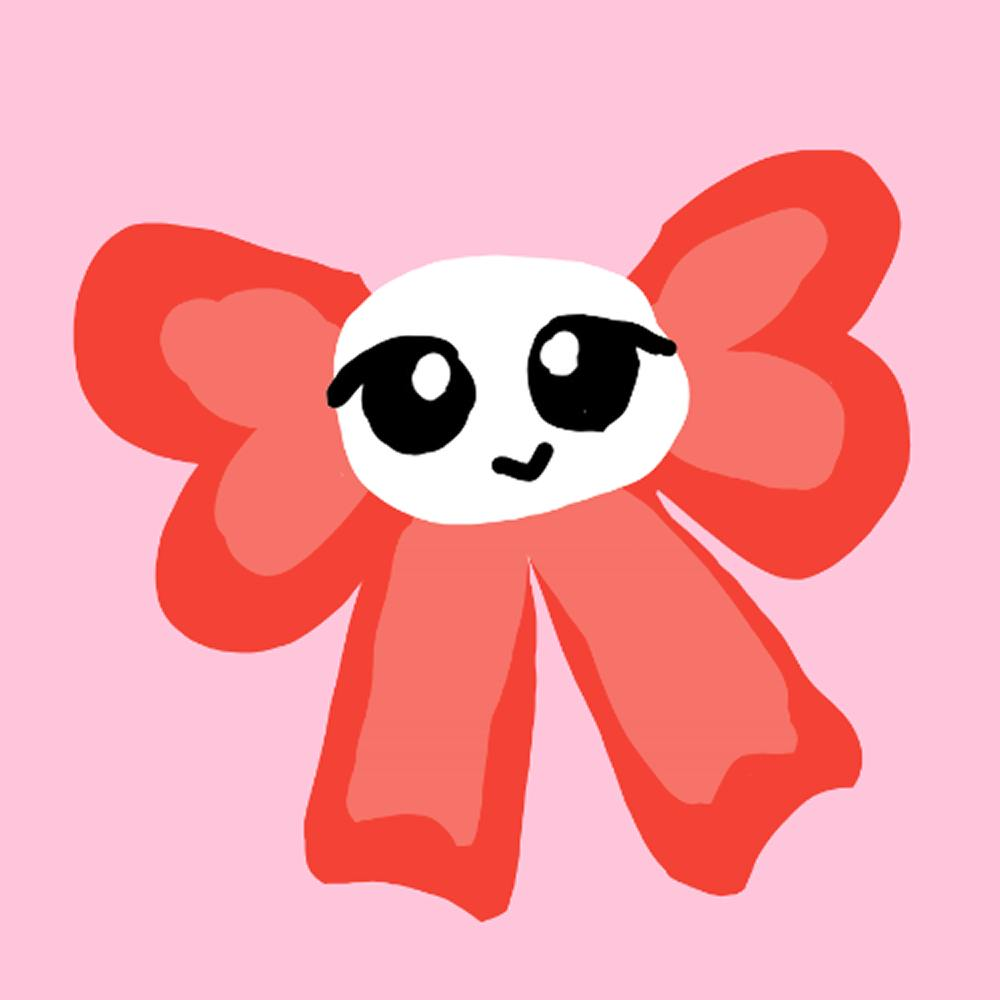
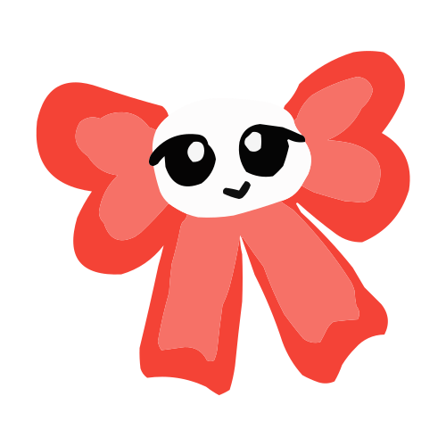

# Retart Images

This repository contains the image assets for the "Retart" NFT collection.

All images (both raster and vector) are 500×500 pixels.

## Contents

- `pngs/` — The original NFT artwork exported as PNG images. Files are organized by token ID (e.g. `123.png`). These are the full, original images.
- `svgs/` — Vectorized versions with the background removed. Each SVG contains only the character artwork (no background), useful for scalable use in web or design projects. Files are named by token ID (e.g. `123.svg`).

## Image details

- Size: 500 × 500 pixels
- PNGs: full original images per token id
- SVGs: background-removed vector character artwork per token id

## Where the collection lives

- OpenSea: https://opensea.io/collection/retarted
- X (formerly Twitter): https://x.com/retartwurl

## Usage

- Use the PNGs when you need the original pixel artwork.
- Use the SVGs when you need scalable, background-free artwork for web pages, overlays, or print.
- File names follow token IDs: replace `<id>` with a token number, for example:

  - `pngs/<id>.png`
  - `svgs/<id>.svg`

## Previewing locally

Open any PNG or SVG in your browser or image editor. For a quick HTML preview, place an image tag in a simple HTML file:

```html


```

## Contributing

If you have additional optimized assets, corrections, open an issue or a pull request and include which token IDs are affected and what the change is.

## Contact

For questions about the collection or licensing, reach out via X: https://x.com/retartwurl

---

Last updated: 2025-10-28
